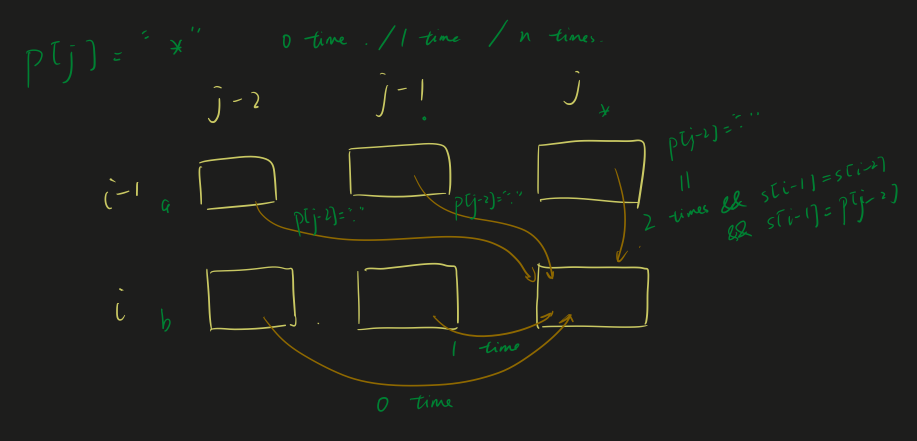

# 10. Regular Expression Matching

[LeetCode 10](https://leetcode.com/problems/regular-expression-matching/)

## Problem

Given an input string (`s`) and a pattern (`p`), implement regular expression matching with support for `'.'` and `'*'`.

```
'.' Matches any single character.
'*' Matches zero or more of the preceding element.
```

The matching should cover the **entire** input string (not partial).

**Note:**

- `s` could be empty and contains only lowercase letters `a-z`.
- `p` could be empty and contains only lowercase letters `a-z`, and characters like `.` or `*`.

**Example 1:**

```
Input:
s = "aa"
p = "a"
Output: false
Explanation: "a" does not match the entire string "aa".
```

**Example 2:**

```
Input:
s = "aa"
p = "a*"
Output: true
Explanation: '*' means zero or more of the preceding element, 'a'. Therefore, by repeating 'a' once, it becomes "aa".
```

**Example 3:**

```
Input:
s = "ab"
p = ".*"
Output: true
Explanation: ".*" means "zero or more (*) of any character (.)".
```

**Example 4:**

```
Input:
s = "aab"
p = "c*a*b"
Output: true
Explanation: c can be repeated 0 times, a can be repeated 1 time. Therefore, it matches "aab".
```

**Example 5:**

```
Input:
s = "mississippi"
p = "mis*is*p*."
Output: false
```

## Methods
### Method 1: Naive RegExp

```JavaScript
var isMatch = function(s, p) {
    let pattern = new RegExp('^' + p + '$');
    return pattern.test(s);
};
```

### Method 2: DP

Intuition: 

The basic idea here is kind of similar with [Edit Distance](./72.%20Edit%20Distance.md).

dp\[i][j] stands for whether it is possible to match s[:i + 1] and p[:j + 1] (i and j inclusive)

Consider the following conditions:

Note:

For the good of notation, neglect the influence of the starting "" to the indices of dp, so here we are using `s[i] === p[j]`, but in the code, we should use `s[i - 1] === p[j - 1]`

* s[i] === p[j]
  * dp\[i][j] = dp\[i - 1][j - 1]
* p[j] === '.'
  * dp\[i][j] = dp\[i - 1][j - 1]
* p[j] === '*'
  * Use previous character 0 time:
    * dp\[i][j] = dp\[i][j - 2]
  * Use previous character 1 time:
    * dp\[i][j] = dp\[i][j - 1]
  * Use previous character 2+ times:
    * This requires s[i] === s[i - 1] and s[i] === p[j - 1]
    * dp\[i][j] = dp\[i - 1][j]
  * If we have ".*" pattern, which is versatile:
    * dp\[i][j] = dp\[i - 1][j] or dp\[i - 1][j - 1] or dp\[i - 1][j - 2]



### Code

JavaScript

```JavaScript
// DP
var isMatch = function(s, p) {
    let dp = Array(s.length + 1).fill().map(() => Array(p.length + 1).fill(false));
    dp[0][0] = true;
    for (let i = 1; i < p.length + 1; i++) {
        dp[0][i] = p[i - 1] === '*' ? dp[0][i - 2] : false;
    }
    for (let i = 1; i < s.length + 1; i++) {
        for (let j = 1; j < p.length + 1; j++) {
            if (s[i - 1] === p[j - 1]) {
                dp[i][j] = dp[i - 1][j - 1];
            } else if (p[j - 1] === '.') {
                dp[i][j] = dp[i - 1][j - 1];
            } else if (p[j - 1] === '*') {
                dp[i][j] = dp[i][j] || dp[i][j - 1]; // * repeats 1 time
                dp[i][j] = dp[i][j] || dp[i][j - 2]; // * repeats 0 time
                if (s[i - 1] === s[i - 2] && s[i - 1] === p[j - 2]) dp[i][j] = dp[i][j] || dp[i - 1][j]; // * repeats 2+ times and s[i - 1] is same as last one
                if (p[j - 2] === '.') dp[i][j] = dp[i][j] || dp[i - 1][j - 2] || dp[i - 1][j - 1] || dp[i - 1][j]; // .* is versatile
            }
        }
    }
    
    // console.log(dp);
    return dp[s.length][p.length];
}
```

c++

```c++

```


### Reference

